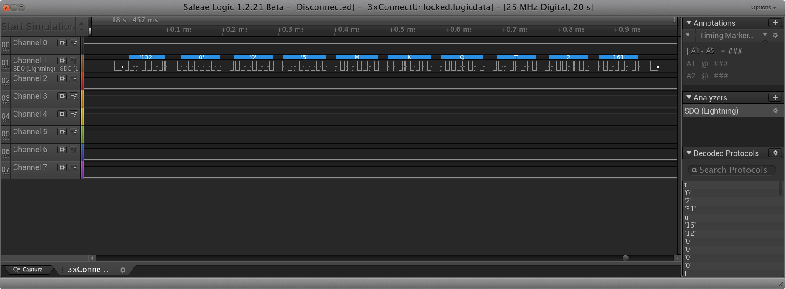

# SDQAnalyzer

This is a simple analyzer for the SDQ protocol that is used on a lot of Apple products, for exapmle:

- Lightning
- MagSafe
- iPhone/iPad battery

It is based on the Saleae example analyzer.
