# Setting up an Analyzer SDK Project

This document details setting up your analyzer project for development on Windows, Mac, and Linux.

Documentation for the Analyzer SDK code is still in the older Saleae Analyzer SDK.pdf.

## Initial Setup (All Platforms)

Before continuing this setup guide, please follow the instructions in the readme file to download, fork or clone this repository, and then run the rename_analyzer.py script. 

## Visual Studio

To build on Windows, open the visual studio project in the Visual Studio folder, and build. The Visual Studio solution has configurations for 32 bit and 64 bit builds. You will likely need to switch the configuration to 64 bit and build that in order to get the analyzer to load in the Windows software.

To test your analyzer, you will need to tell the Saleae Logic software where to load find your compiled analyzer dll.

The four build combinations produce analyzer dll files in the following locations:
```
.\Visual Studio\Win32\Debug\<Your Analyzer's Name>Analyzer.dll
.\Visual Studio\Win32\Release\<Your Analyzer's Name>Analyzer.dll
.\Visual Studio\x64\Debug\<Your Analyzer's Name>Analyzer.dll
.\Visual Studio\x64\Release\<Your Analyzer's Name>Analyzer.dll
```

Instructions to tell the Saleae Logic software where to find your new analyzer dll can be found here:
[How to set the developer directory in the Saleae software to use third party or user created analyzers.](http://support.saleae.com/hc/en-us/articles/208667506)

Once you have set that directory and restarted the software, your new custom analyzer should appear in the list of analyzers you can add.

## Debugging an Analyzer with Visual Studio

Newer versions of the Saleae software cannot be used to debug custom analyzers. This means that older versions of the software and SDK must be used if you wish to attach a debugger and step through your code.

*Note: it is impossible to attach a debugger to any version of the software that supports the new products. We are working on a solution to this problem, but for now that means you must rely on the simulation data generator for your analyzer to produce captures you can then debug in the older software.*

To debug your custom analyzer, we recommend you use the 1.1.14 SDK with the 1.1.18 software. Because older versions of the software and SDK are 32 bit only, you will only be able to compile for 32 bit initially. Later, when you build the analyzer with the latest version of the SDK, you will be able to compile for 32 bit and 64 bit.

The SampleAnalyzer repository and the AnalyzerSDK repository have been setup to make switching versions of the SDK easy. The SampleAnalyzer repository has a branch named "1.1.14-for-win32-debug". This branch and the master branch have exactly the same source code - the only difference is the project settings and the AnalyzerSDK submodule reference, which now points to the 1.1.14 AnalyzerSDK. 

Download the 32 bit stand-alone copy of the 1.1.18 software. The 32 bit standalone copy is required because the normal installer will not let you install the 32 bit software on a 64 bit operating system.

Logic 1.1.18, 32 bit stand-alone:
http://downloads.saleae.com/betas/1.1.18/Logic1.1.18BetaWin32Standalone.zip

This is also convenient because you will not need to uninstall the latest Saleae Logic software, or install this version. Simply unzip and run the 1.1.18 software.

Please note - switching between Saleae Logic software versions has a tendency to reset the software's settings. This could cause the analyzer developer directory to get reset. If you no longer see your analyzer in the list, please verify that the analyzer developer directory is still set properly.

To build and and debug your custom analyzer using the 1.1.14 sofware, follow these steps:

- Switch to the "1.1.14-for-win32-debug" branch of the SampleAnalyzer repository.
- Using Visual Studio, open the solution file in the Visual Studio Folder.
- Switch the solution platform to from x64 to Win32. x64 is not able to build on this branch.
- Build the debug configuration.
- Launch the 1.1.18 32-bit Logic software. If the analyzer directory is not already configured, set that, and restart the software.
- The analyzer should now be visible in the list of analyzers you can add.
- In visual studio, open the Debug Menu, and select "Attach to process..."
- Locate Logic.exe in the list, select it, and click the Attach button.
- Add a break point on any line near the top of the WorkerThread() function, such as line 27, *mSampleRateHz = GetSampleRate();*
- In the Logic software, add your custom analyzer if you haven't already, and start a simulation.
- The breakpoint should hit.


**Updating to the latest SDK**

Once you have finished debugging your analyzer using the "1.1.14-for-win32-debug" branch, we recommend committing your changes and then cherry-picking your commits to the master branch. Please do not simply merge changed into the master branch, as that may pick up other project settings not compatible with the latest SDK.

In the future, we would like to simplify this even more, so branch switching is not required.


**Common issues on Windows**

- The software says "Unable to 'LoadLibrary' on dll ... is not a valid Win32 application"
    This is most likely because the analyzer was not built for the same platform architecture as the software running it. In almost all cases, this means the analyzer was compiled for 32 bit instead of 64 bit. Details to switch from 32 bit to 64 bit are included in the Analyzer SDK documentation on page 9. First, [add a x64 target to your project](https://msdn.microsoft.com/en-us/library/ms185328(v=vs.120).aspx). Then, edit the linker settings for the 64 bit configuration. Change the additional dependencies item from Analyzer.dll to Analyzer64.dll. 
    Note: Only the software versions 1.1.16 and later were built for 64 bit. Previous releases, including 1.1.15, were 32 bit only, which is why no 64 bit analyzer dll was provided.
- The Saleae software crashes on launch when the debugger is attached.
    Versions after about 1.1.18 no longer allow debuggers to attach. In these cases, we recommend building with the 32 bit version of the 1.1.18 beta and the 1.1.14 SDK, and debug there. This restriction only applies to Windows.

## Linux

*Note: When using git clone, please remember to use --recursive to automatically also clone the AnalyzerSDK submodule*

After you have cloned, forked, or downloaded the repository, and ran the rename_analyzer.py script, there are two additional steps required to run the analyzer.

First, if you are using Linux 64 bit, you need to delete the 32 bit libAnalyzer.so file, and rename the libAnalyzer64.so file to just libAnalyzer.so.

```
mv AnalyzerSDK/lib/libAnalyzer64.so AnalyzerSDK/lib/libAnalyzer.so
```

Then run build_analyzer.py

```
python build_analyzer.py
```

That's it! To debug the analyzer, you need to first tell the Saleae Logic software where to find your newly compiled *.so file.

[How to set the developer directory in the Saleae software to use third party or user created analyzers.](http://support.saleae.com/hc/en-us/articles/208667506)

The two variants of the newly compiled analyzer can be found here:

```
debug/lib<Your Analyzer's Name>Analyzer.so
release/lib<Your Analyzer's Name>Analyzer.so
```

### Debugging with GDB on Linux

To debug your analyzer, you will need to attach gdb to the Logic application, something like this:
```
gdb /Home/YourUserName/Desktop/Logic 1.2.14 (64-bit)/Logic
```
And then test setting a breakpoint like this:
```
break MyAnalyzer::WorkerThread
```
Because your analyzer hasn't been loaded yet, GDB will notify you that it can't find this function, and ask if you want to automatically set this breakpoint if a library with a matching function is loaded in the future.  Type y <enter>

Then type run to start the application. Add your custom analyzer and start a simulation. This will trigger the breakpoint.

## MacOS

### Build Script Based Project

*Note: When using git clone, please remember to use --recursive to automatically also clone the AnalyzerSDK submodule*

After you have cloned, forked, or downloaded the repository, and ran the rename_analyzer.py script, there is one additional step required to run the analyzer.

run build_analyzer.py

```
python build_analyzer.py
```

That's it! To debug the analyzer, you need to first tell the Saleae Logic software where to find your newly compiled *.dylib file.

[How to set the developer directory in the Saleae software to use third party or user created analyzers.](http://support.saleae.com/hc/en-us/articles/208667506)

```
debug/lib<Your Analyzer's Name>Analyzer.dylib
release/lib<Your Analyzer's Name>Analyzer.dylib
```

### Debugging with GDB on MacOS

To debug your analyzer, you will need to attach gdb to the Logic application, something like this:
```
gdb /Applications/Logic.app/Contents/MacOS/Logic
```
And then test setting a breakpoint like this:
```
break MyAnalyzer::WorkerThread
```
Because your analyzer hasn't been loaded yet, GDB will notify you that it can't find this function, and ask if you want to automatically set this breakpoint if a library with a matching function is loaded in the future.  Type y <enter>

Then type run to start the application. Add your custom analyzer and start a simulation. This will trigger the breakpoint.


### XCode Based Project

**Note: This section hasn't yet been updated to describe the proper setup using a fork or clone of the new Github repository for the Sample Analyzer. The instructions will still work, but need improvement to work well with the git repository.**

This section was written using the 1.1.32 Analyzer SDK, Xcode version 7.2.1, and OSX 10.10.5. however it is likely to work with other versions as well.

- Start Xcode
- Click "Create a new Xcode project"

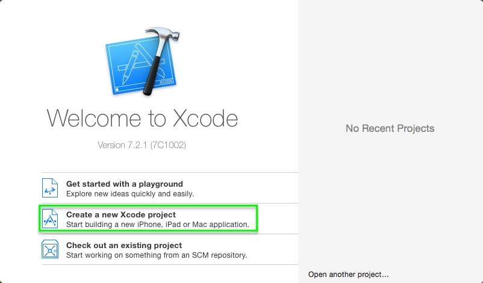

- select "Other" from the left column, and "Empty" from the templates list. 
- Click next.

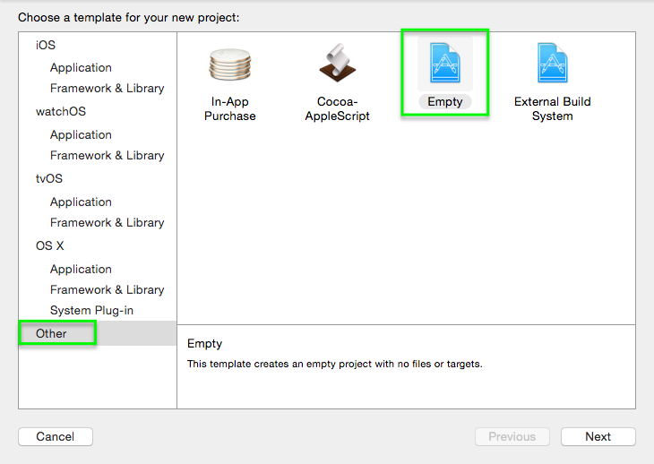

- Enter a name for your Xcode Project.

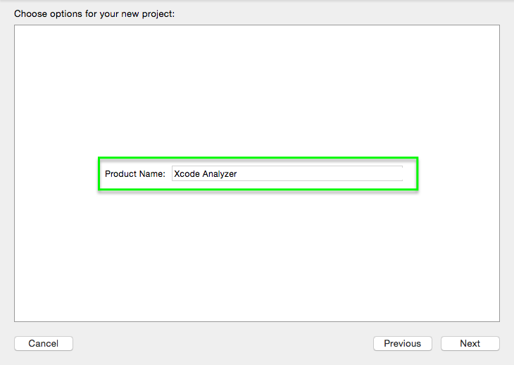

- The location should be set to the analyzer SDK folder recently downloaded, "SaleaeAnalyzerSdk-1.1.32". Do not create a new folder, this will be done for  you by Xcode. 
- Click "Create"

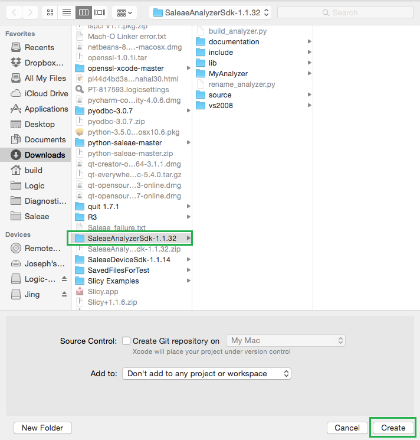

- Back in Finder, copy the file "rename_analyzer.py" and "source" from the downloaded SDK directory into the freshly created folder, which will have the same name as your new analyzer. Shown here the name is "XcodeAnalyzer"

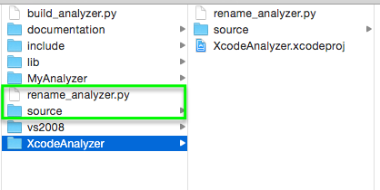

- Open a terminal, and browse to the new project folder in the downloaded SDK folder.
- Run the python script with:

    python rename_analyzer.py

- first, it will prompt you for the class prefix for all of the source files. All classes and files will be re-named with this prefix. If you type "I2C" the classes and files will be named with "I2CAnalyzer". Please avoid using analyzer in this name, as it will get repeated like this: "I2CAnalyzerAnalyzer"
- Second, it will ask you for the name to display to the user in the "Add Analyzers" menu. This should be the user facing name, and can include spaces.

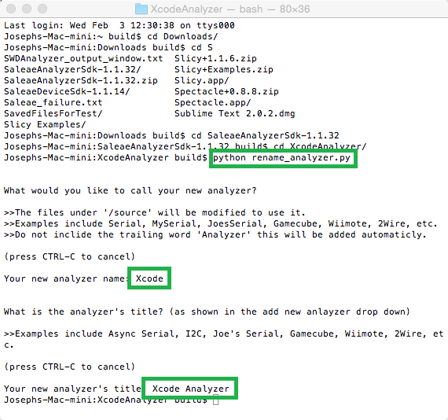

- Next, we need to add a target to the Xcode project. Be sure that the project is selected in the Project Navigator on the left, and then click the menu highlighted below to add a target.

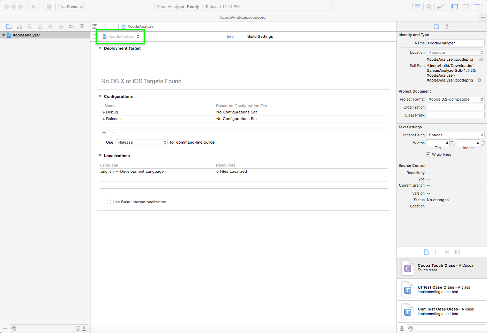

- This is the target menu.

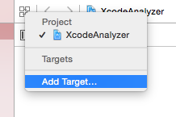

- Select "Framework & Library" under "OS X" in the left column, and select "Library" in the main area.
- Click Next.


- Enter a product name, we recommend the the same name as the project, since there will only be one product.
- Under framework, select "None (Plain C/C++ Library)
- For Type, select "Dynamic"

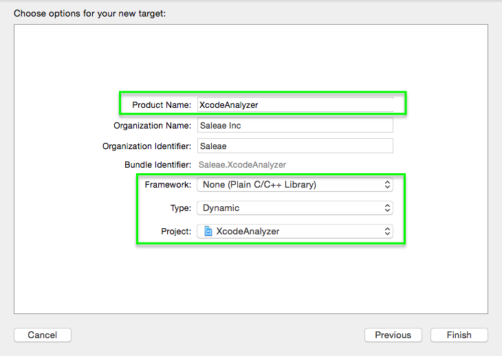

- Next, we need to add the source files. Click File -> Add Files to "<project name>"...
- Note: if this is disabled, it is because you do not have the project selected in the Project Navigator.

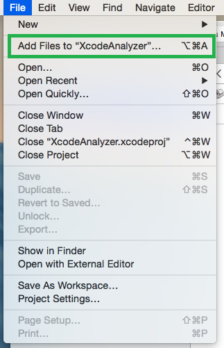

- Browse to the source folder in the Xcode project folder, and select it. Don't select the contents, be sure to select the folder itself.
- select "Create groups" in the "added folders" section.
- Click Add.

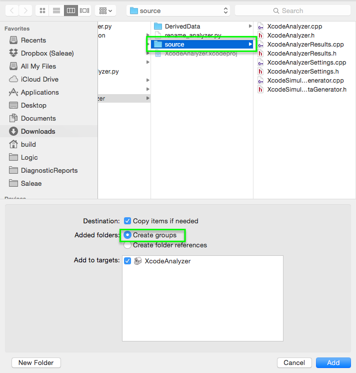

- Verify that the files were automatically added to the build phases "Compile Sources" and "Headers".
- Select the project from the Project Navigator if not already selected.
- Click "Build Phases".
- Expand "Compile Sources" and "Headers"
- Under "Headers", also expand "Project".
- Verify that each has 4 files.

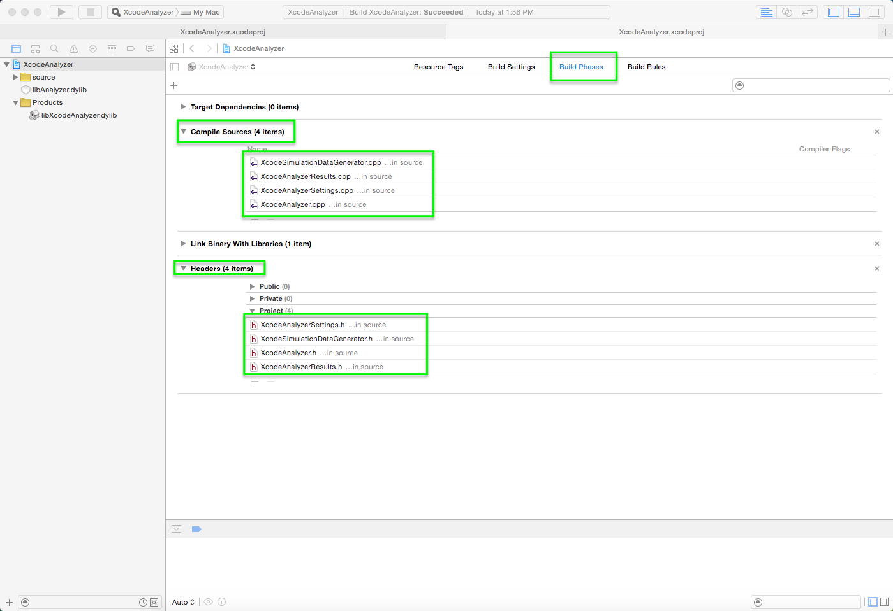

- Click "Build Settings"
- If "Levels" is selected, switch it to "Combined"

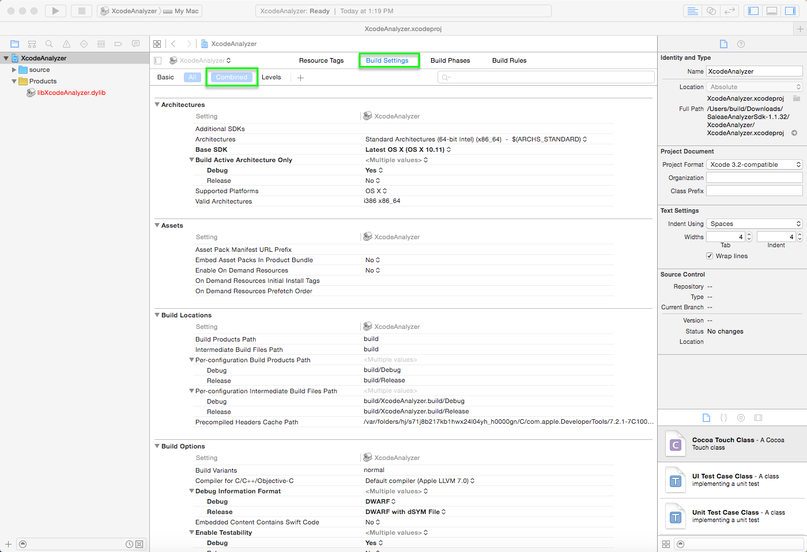

- Expand the section "Search Paths"
- Locate "Header Search Paths" and edit the value.
- Click the "+" button and enter "../include" in the new entry.

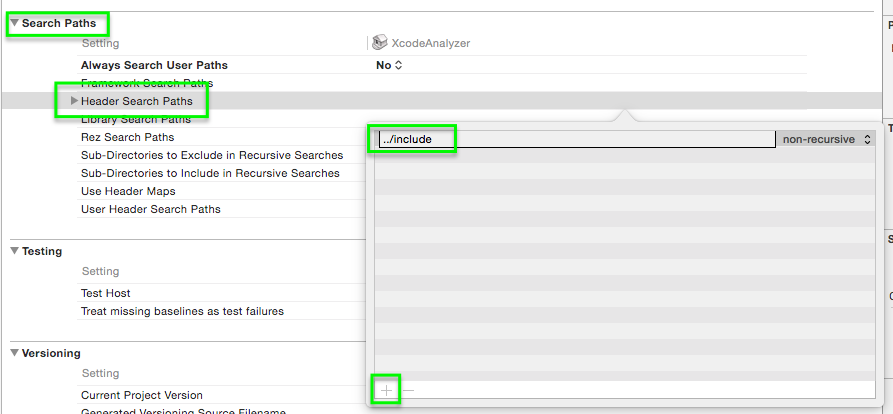

- Locate "Library Search Paths" in the same section, and edit its value.
- Click the "+" button and enter "../lib" in the new entry.

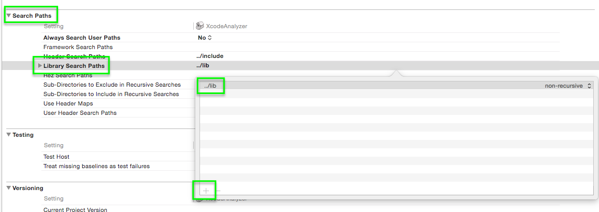

- Return to "Build Phases" and expand the section "Link Binary with Libraries"
- Click the "+" button

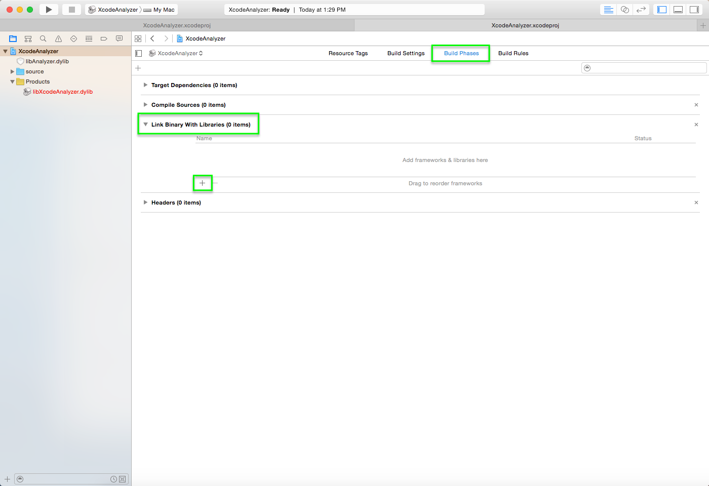

- Click "Add Other..."

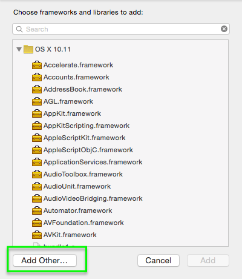

- Browse to the original SDK folder which contains our Xcode folder.
- Open the "lib" folder
- Select "libAnalyzer.dylib"
- Click Open.

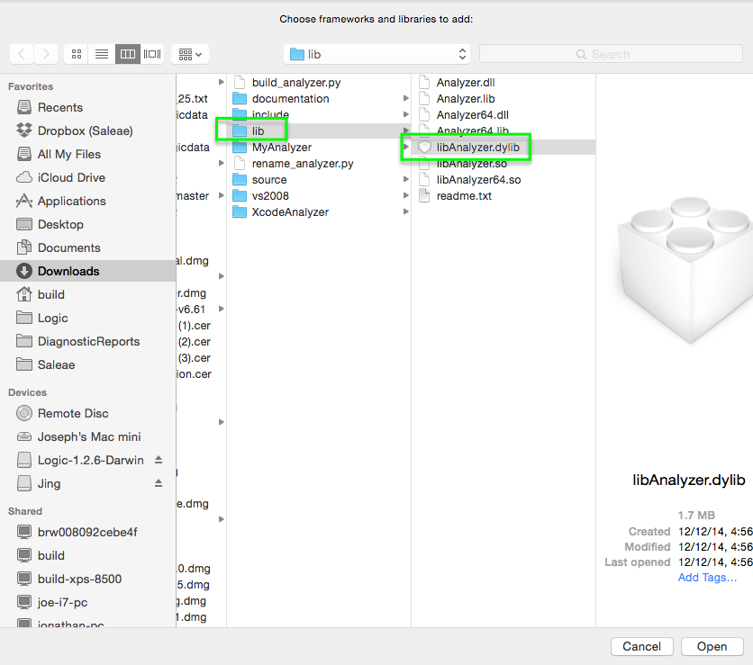


- At this point, you should build the project, so that the resulting library will be created.
- It's worth mentioning that new Xcode versions do not save build outputs in the project directory. Instead, the default output directory looks like this:

    ~/Library/Developer/Xcode/DerivedData

- You may want to change it. **The following steps are optional**

**Optional: change build output folder**

- Optional step 1: From the file menu, select "Project Settings..."

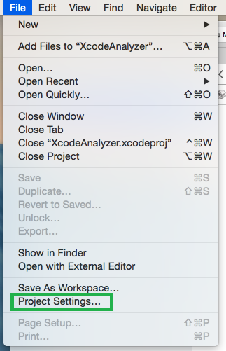

- Optional step 2: in the "Derived Data" dropdown, select "Project-relative Location"
- Click "Done"

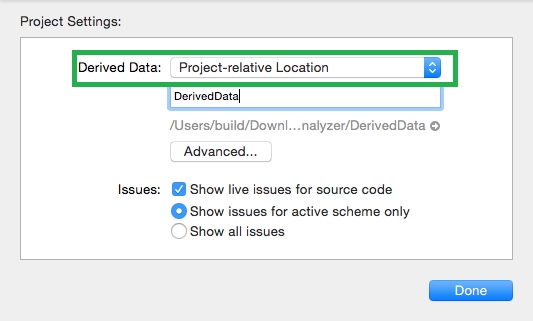

- That's it for the optional steps.

### Running and Debugging your Analyzer

- Next we will setup debugging for the project. Be sure to have the latest Saleae Logic Software installed.
- On the Product menu at the top of the screen, select "Scheme" -> "Edit Scheme..."
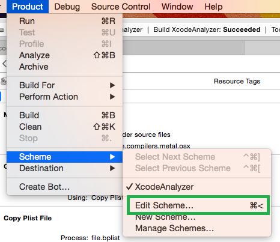

- Make sure "Run" is selected on the left.
- Under "Executable" select "Other..."
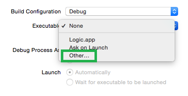

- Browse to the "Applications" folder (or wherever Logic is installed) and select "Logic.app"
- Click Choose.

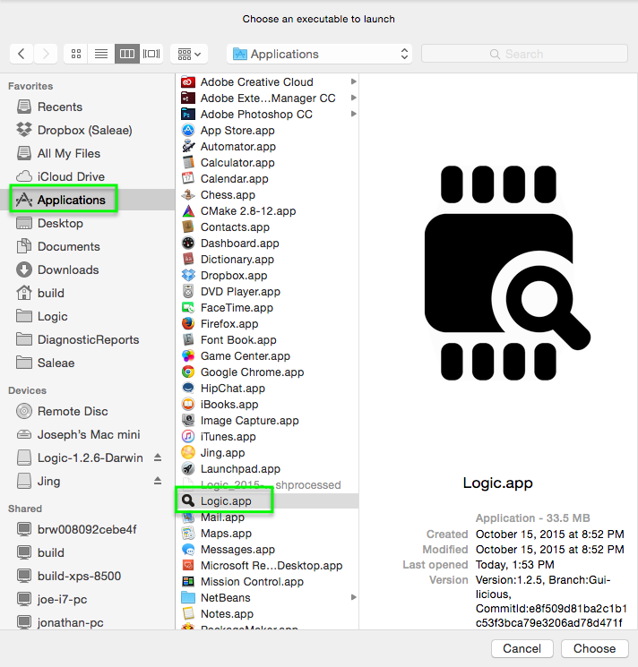


- Set a breakpoint in the software so that we can test debugging.
- Open "XcodeAnalyzer.cpp" on the left. The name will reflect what you selected as the class prefix in a previous step. In this example, the class prefix was "Xcode".
- In the source file, add a break point to the first line of code in the WorkerThread method. This code runs when the analyzer starts processing data.


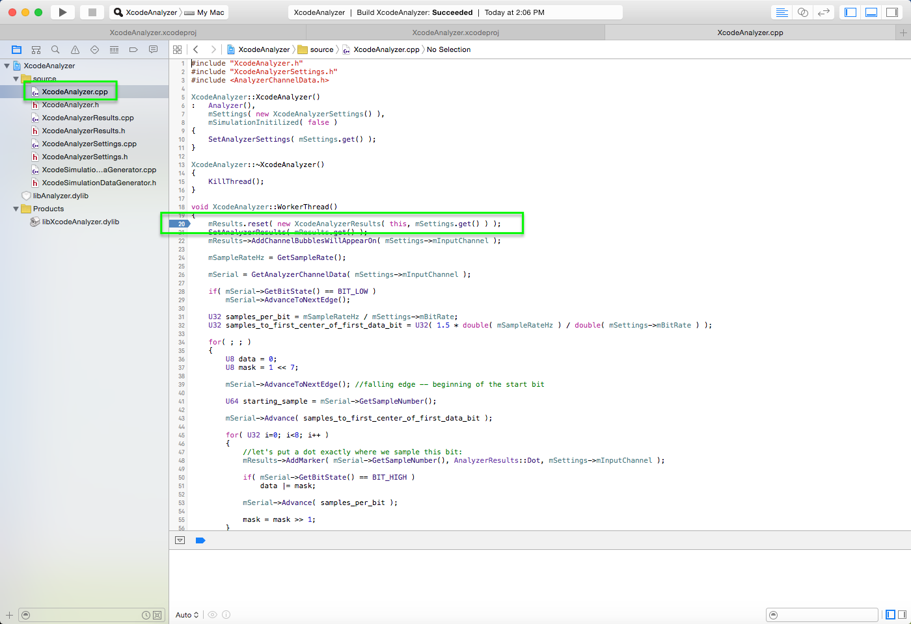

- Before proceeding, see this article with instructions to configure the software to load your new analyzer: https://trello.com/c/LEFlqhlL
- Be sure to select the folder where the debug version of the custom analyzer is is saved.

- Once the Saleae logic software has been configured, and has been closed, click run from Xcode.
- The Saleae software should launch a few seconds later. Click the "+" button on the analyzers panel, and then select your analyzer. In this case, the user facing name of the analyzer was set by the Python script to "Xcode Analyzer". Yours may be different.
- If your analyzer is missing, it could indicate that the dylib was not created, or that the developer path was not set properly. Please review the previous steps for any possible errors.
- The settings dialog for your custom analyzer will appear. Click "Save".

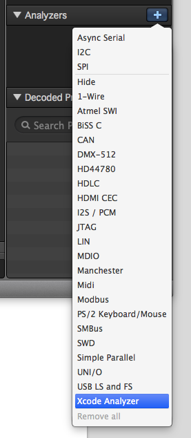

- Here is your fresh new analyzer, now added to the software. Note that our breakpoint hasn't fired yet. If you had captured data previously, it might fire now, since analyzers will automatically start processing if they are added to an existing analyzer.

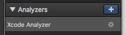

- Press start to start a simulation.
- Since your analyzer has already been added, the simulator will call your simulation data generator code. The analyzer also starts processing the moment data has been captured, so your breakpoint should fire immediately.

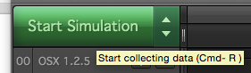

- Here you can see that the debugger was attached and your break point has been hit. You can examine variables, set new break points, or press continue from the debug menu at the bottom.

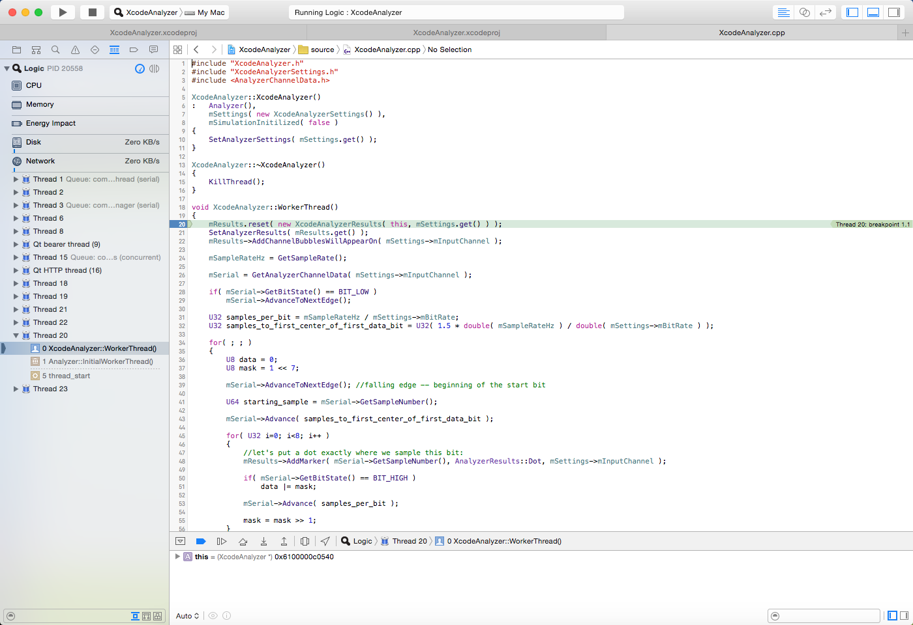

- Congratulations! You now have an Xcode project for which you can use to develop a custom analyzer for the Saleae software.

If you have any questions, please contact support.